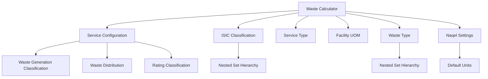

# Waste Calculator Documentation

## Overview

The **Waste Calculator** is a virtual DocType that calculates waste generation for facilities based on industry-specific configurations. It supports multiple calculation methodologies, automatic waste type validation, and generates comprehensive reports with waste composition details.

---

## Table of Contents

1. [Key Features](#key-features)
2. [Architecture](#architecture)
3. [Calculation Methods](#calculation-methods)
4. [Configuration System](#configuration-system)
5. [Validation & Auto-Population](#validation--auto-population)
6. [Waste Type Management](#waste-type-management)
7. [Report Generation](#report-generation)
8. [API Reference](#api-reference)
9. [Usage Guide](#usage-guide)
10. [Technical Details](#technical-details)

---

## Key Features

### 🔢 Dual Calculation Methods
- **Cluster Classification**: Threshold-based facility size matching
- **Generation Rate**: Direct rate multiplication (Mean/Median)

### 🎯 Smart Configuration Lookup
- **General Configuration**: Fallback for all ISIC classifications
- **ISIC-Specific Configuration**: Industry-tailored calculations
- **Hierarchical Traversal**: Auto-search through ISIC tree (Activity → Category → Group → Division → Section)

### ✅ Intelligent Validation
- **Composite UOM Handling**: Automatic multiplication (e.g., Length × Width)
- **Waste Type Validation**: Ensures leaf waste selection from group categories
- **Auto-Population**: Automatically adds leaf waste types from configuration

### 📊 Comprehensive Reporting
- Configuration summary with calculation paths
- Waste type distributions with densities
- Selected waste types with descriptions
- Step-by-step calculation breakdown
- Safety factor applications

---

## Architecture

### DocType Structure

```
Waste Calculator (Virtual DocType)
├── Input Fields
│   ├── service_type (Link: Service Type)
│   ├── isic_classification (Link: ISIC Classification)
│   ├── facility_uom (Link: Facility UOM)
│   ├── facility_measurement (Float/Composite)
│   ├── calculation_based_on (Select)
│   ├── apply_facility_ratings (Check)
│   ├── facility_rating (Int)
│   └── wastes (Table MultiSelect)
│
├── Output Fields
│   ├── facility_unit_generation_rate (Float)
│   ├── regional_safety_factor (Percent)
│   ├── rating_safety_factor (Percent)
│   ├── facility_generated_waste (Float)
│   ├── total_generated_waste (Float)
│   ├── suggested_container (Data)
│   ├── suggested_container_count (Int)
│   ├── waste_calculation (Text Editor)
│   └── configuration_remarks (Small Text)
│
└── Child Tables
    └── facility_measurements (for composite UOMs)
        ├── uom (Data)
        ├── uom_value (Float)
        └── must_be_whole_number (Check)
```

### Dependencies



---

## Calculation Methods

### 1. Cluster Classification

#### Logic Flow
1. **Input**: Facility measurement (e.g., 300 m²)
2. **Match**: Find cluster where `facility_measurement ≤ max_threshold`
3. **Output**: Use cluster's `total_converted_volume` directly
4. **Container**: Use cluster's `container_type` and `count`
5. **Fallback**: If exceeded all clusters, use mean/median generation rate

#### Example
```python
# Configuration has 5 clusters:
Cluster 1: max_threshold=150, volume=9.17 m³, container=12y×1
Cluster 2: max_threshold=300, volume=18.35 m³, container=12y×2
Cluster 3: max_threshold=500, volume=27.52 m³, container=12y×3
Cluster 4: max_threshold=1000, volume=30.58 m³, container=20y×2
Cluster 5: max_threshold=1500, volume=45.87 m³, container=20y×3

# Facility: 300 m²
# Result: Matches Cluster 2
# Waste: 18.35 m³
# Container: 12 yards × 2
# Generation Rate: 18.35 / 300 = 0.0612 m³/m² (for display)
```

#### When Threshold Exceeded
```python
# Facility: 1650 m² (exceeds all clusters)
# Fallback: Use mean_generation_rate = 0.038 m³/m²
# Waste: 1650 × 0.038 = 62.7 m³
# Container: Calculate from total waste
```

### 2. Generation Rate Method

#### Logic Flow
1. **Input**: Facility measurement
2. **Rate**: Use `mean_generation_rate` or `median_generation_rate`
3. **Calculate**: `waste = facility_measurement × generation_rate`
4. **Container**: Match against cluster volumes or scale proportionally

#### Example
```python
# Configuration:
mean_generation_rate = 0.038 m³/m²

# Facility: 500 m²
# Calculation: 500 × 0.038 = 19 m³
# Container: Find smallest cluster ≥ 19 m³
```

### Rate Calculation Statistics

Service Configurations automatically calculate:
- **mean_threshold**: Average of all max_threshold values
- **median_threshold**: Median of max_threshold values
- **mean_volume**: Average of all total_converted_volume values
- **median_volume**: Median of total_converted_volume values
- **mean_generation_rate**: `mean_volume / mean_threshold`
- **median_generation_rate**: `median_volume / median_threshold`

---

## Configuration System

### Priority Order

```
1. General Configuration (is_general_configuration=1)
   ├── Applies to ALL ISIC classifications
   ├── No ISIC classification linked
   ├── One per service_type (uniqueness enforced)
   └── Highest priority in lookup
   
2. ISIC-Specific Configuration
   ├── Linked to specific ISIC classification
   ├── Hierarchical traversal if not found:
   │   Activity → Category → Group → Division → Section
   └── Most configurations defined at Group level (224 configs)
```

### Configuration Lookup Algorithm

```python
def _get_service_config_from_hierarchy(isic_classification, service_type):
    # STEP 1: Check General Configuration
    general_config = find_general_config(service_type)
    if general_config:
        return general_config
    
    # STEP 2: Traverse ISIC Hierarchy
    current_isic = isic_classification
    while current_isic:
        config = find_config(current_isic, service_type)
        if config:
            return config
        current_isic = get_parent_isic(current_isic)
    
    return None
```

### Service Configuration Fields

#### Core Settings
- `service_type` (Link): Service Type
- `isic_classification` (Link): ISIC Classification (optional for general)
- `is_general_configuration` (Check): Mark as general fallback
- `calculate_facility_wastes_by` (Select): "Cluster Classification" or "Generation Rate"
- `calculate_generation_rate_by` (Select): "Mean" or "Median"
- `facility_uom` (Link): Expected facility UOM
- `default_volume_unit` (Link): Output volume unit

#### Child Tables
1. **Waste Generation Classification** (Clusters):
   - `max_threshold`: Facility size threshold
   - `container_type`: Container specification
   - `count`: Number of containers
   - `container_standard_volume`: Volume in yards
   - `container_volume_unit`: "Cubic Yard"
   - `total_volume`: `container_standard_volume × count`
   - `conversion_factor`: Yard to default unit
   - `container_converted_volume`: Converted single container
   - `total_converted_volume`: Total in default unit

2. **Waste Distribution** (Expected composition):
   - `waste_type`: Waste type (can be group or leaf)
   - `is_group`: Fetched from waste type
   - `distribution_percentage`: Expected % (must total 100%)

3. **Rating Classification** (Safety factors):
   - `rating`: Facility rating (1-5)
   - `safety_factor`: Additional percentage

---

## Validation & Auto-Population

### Waste Type Validation Logic

```python
For each waste_type in waste_distributions:
    if waste_type.is_group == 0 (Leaf):
        → Auto-add to wastes field (if not already selected)
    
    if waste_type.is_group == 1 (Group):
        → Validate: User must select ≥1 leaf descendant
        → Error if no selection made
```

### Example Validation

**Configuration has:**
- Mixed Waste (Group) - distribution: 40%
- Organic Waste (Group) - distribution: 30%
- Hazardous Waste (Leaf) - distribution: 30%

**User must select:**
- ✅ At least one leaf from "Mixed Waste" category (e.g., Paper, Plastic, Glass)
- ✅ At least one leaf from "Organic Waste" category (e.g., Food waste, Garden waste)
- ✅ "Hazardous Waste" auto-added (leaf type)

**Validation Error:**
```
"Please select at least one waste type from the 'Mixed Waste' category in the Wastes field."
```

### Composite UOM Handling

For composite UOMs (e.g., "Floor Area" = Length × Width):

```python
# Child table: facility_measurements
Row 1: Length = 20 meters, must_be_whole_number = 0
Row 2: Width = 15 meters, must_be_whole_number = 0

# Calculation
facility_measurement = 1
for row in facility_measurements:
    validate_whole_number(row.uom_value, row.must_be_whole_number)
    facility_measurement *= row.uom_value

# Result: 20 × 15 = 300 m²
```

---

## Waste Type Management

### Waste Type Hierarchy

```
All Waste Types (Root)
├── Mixed Waste (Group)
│   ├── Paper Waste (Leaf) - density: 150 kg/m³
│   ├── Plastic Waste (Leaf) - density: 100 kg/m³
│   └── Glass Waste (Leaf) - density: 400 kg/m³
├── Organic Waste (Group)
│   ├── Food Waste (Leaf) - density: 500 kg/m³
│   └── Garden Waste (Leaf) - density: 300 kg/m³
└── Construction and Demolition Waste (Group)
    ├── Concrete Waste (Leaf) - density: 2000 kg/m³
    ├── Wood Waste (Leaf) - density: 600 kg/m³
    ├── Metal Waste (Leaf) - density: 1500 kg/m³
    └── ... (10 total C&D waste types)
```

### Waste Type Fields
- `waste_name` (Data): Display name
- `parent_waste_type` (Link): Parent in hierarchy
- `is_group` (Check): Group vs Leaf indicator
- `waste_standard_density` (Float): Standard density
- `waste_density_unit` (Link): Density UOM
- `description` (Small Text): Waste description

### Helper Functions

```python
# Get all leaf descendants of a waste type
leaf_descendants = get_leaf_descendants("Mixed Waste")
# Returns: ["Paper Waste", "Plastic Waste", "Glass Waste"]

# Get allowed waste types for selection
allowed_wastes = get_allowed_waste_types(waste_distributions)
# Returns: All leaf types from distribution categories
```

---

## Report Generation

### Report Structure

The `waste_calculation` HTML report includes:

#### 1. Configuration Summary
- Service Configuration name
- Calculation method used
- Facility measurement with UOM
- Generation rate with proper units
- Threshold cluster details (if applicable)

#### 2. Waste Type Distribution Table
Columns:
- **Waste Type**: Name + description (if available)
- **Type**: Badge indicator (Group/Leaf)
- **Distribution**: Percentage from configuration
- **Density**: Standard density with unit

Features:
- Color-coded headers (#34495e)
- Alternating row colors (#f8f9fa / #fff)
- Group/Leaf badges for clarity

#### 3. Selected Waste Types Table
Columns:
- **Waste Type**: User-selected leaf types
- **Standard Density**: With density unit

Features:
- Green header (#27ae60)
- Shows only user selections
- Includes descriptions

#### 4. Calculation Details
- Base facility waste formula
- Safety factors (if applied)
- Final calculation with factors
- Total generated waste (highlighted)

#### 5. Default Measurement Units
Footer showing system-wide units:
- Volume unit (e.g., Cubic Meter)
- Mass unit (e.g., Kilogram)
- Density unit (e.g., kg/m³)

### Report Styling

All styling is **ultra-compact** with:
- Zero padding on all elements
- Zero margins on all elements
- No border-radius
- Minimal line-height (1.1)
- Small font sizes (0.8-0.95em)
- Borders only for table structure

---

## API Reference

### Main Calculation Method

```python
@frappe.whitelist()
def calculate_waste(doc)
```

**Parameters:**
- `doc` (dict/str): Waste Calculator document as dict or JSON string

**Returns:**
```python
{
    'facility_unit_generation_rate': float,
    'regional_safety_factor': float,
    'rating_safety_factor': float,
    'facility_generated_waste': float,
    'total_generated_waste': float,
    'suggested_container': str,
    'suggested_container_count': int,
    'waste_calculation': str (HTML),
    'configuration_remarks': str
}
```

**Process Flow:**
1. Validate required fields
2. Get ISIC classification details
3. Lookup service configuration (general → hierarchy)
4. Validate and auto-populate waste types
5. Calculate facility measurement
6. Execute calculation method
7. Apply safety factors
8. Suggest containers
9. Build detailed report
10. Return results

### Utility Methods

#### Service Type Details
```python
@frappe.whitelist()
def get_service_type_details(service_type)
```
Returns: `grants_license`, `apply_service_duration`

#### Facility UOM Details
```python
@frappe.whitelist()
def get_facility_uom_details(facility_uom)
```
Returns: `must_be_whole_number`, `is_composite_uom`

#### Service Configuration Lookup
```python
@frappe.whitelist()
def get_service_configuration(isic_classification, service_type)
```
Returns: `waste_distributions`, `service_configuration`

#### Allowed Facility UOMs
```python
@frappe.whitelist()
def get_allowed_facility_uoms(service_configuration)
```
Returns: List of allowed UOM names (default + subsidiaries)

#### Facility UOM Hierarchy
```python
@frappe.whitelist()
def get_facility_uom_hierarchy(facility_uom)
```
Returns: List of UOMs in composite hierarchy

#### Allowed Waste Types
```python
@frappe.whitelist()
def get_allowed_waste_types(waste_types)
```
Returns: All leaf descendants of provided waste types

### Internal Helper Methods

#### Configuration Lookup
```python
def _get_service_config_from_hierarchy(isic_classification, service_type)
```
Returns: Configuration dict with `config`, `found_at`, `found_level`, `checked_path`

#### Waste Type Descendants
```python
def get_leaf_descendants(waste_type)
```
Returns: List of leaf waste type names (optimized single query)

#### Validation & Population
```python
def validate_and_populate_wastes(doc, service_config)
```
Validates group selections and auto-adds leaf types

#### Whole Number Validation
```python
def validate_whole_number(value, must_be_whole, field_label)
```
Throws error if non-whole when required

#### Facility Measurement Calculation
```python
def calculate_facility_measurement(doc)
```
Returns: Multiplied composite UOM or simple measurement

#### Cluster Classification
```python
def calculate_by_cluster_classification(service_config, facility_measurement, doc)
```
Returns: Dict with `facility_waste`, `generation_rate`, `method`, cluster details

#### Generation Rate
```python
def calculate_by_generation_rate(service_config, facility_measurement, doc)
```
Returns: Dict with `facility_waste`, `generation_rate`, `method`

#### Container Suggestion
```python
def suggest_container(total_waste, waste_volume_unit, service_config_name)
```
Returns: Dict with `container`, `count`

#### Report Building
```python
def build_calculation_details(facility_measurement, calc_result, ...)
```
Returns: HTML string with complete report

```python
def build_waste_distributions_section(service_config, doc)
```
Returns: HTML string with waste tables

---

## Usage Guide

### Basic Usage

1. **Select Service Type**
   - Choose appropriate service (e.g., "Construction and Demolition Waste")
   - System fetches `apply_service_duration` flag

2. **Select ISIC Classification**
   - Choose industry classification (preferably Activity level)
   - System searches for configuration (general → hierarchy)

3. **Select Facility UOM**
   - Choose measurement unit (e.g., "Floor Area")
   - System checks if composite UOM

4. **Enter Facility Measurement**
   - For simple UOM: Enter single value
   - For composite UOM: Fill child table (e.g., Length, Width)
   - System validates whole number requirements

5. **Select Waste Types**
   - System auto-shows allowed waste types
   - Select at least one leaf from each group category
   - Leaf types from configuration auto-added

6. **Calculate**
   - Click "Calculate Waste" button
   - System validates, calculates, and generates report

### Advanced Features

#### Calculation Based On
- **Service Configuration** (default)
- **Regional Service Configuration** (future)

#### Facility Ratings
- Enable `apply_facility_ratings`
- Select rating (1-5)
- System applies rating safety factor from configuration

#### Container Suggestions
- Automatic from cluster (Cluster Classification)
- Calculated from total waste (Generation Rate)
- Proportional scaling if exceeded

---

## Technical Details

### Time Frame Handling

The system intelligently handles time frames based on service type:

```python
if service_type.apply_service_duration:
    # Show "All calculations are on DAILY basis"
    display_time_frame = True
else:
    # One-time collection (e.g., Construction waste)
    display_time_frame = False
```

### Container Scaling Algorithm

When waste exceeds largest cluster:

```python
largest_cluster = classifications[-1]
scale_factor = total_waste / largest_cluster.total_converted_volume
count_needed = math.ceil(largest_cluster.count * scale_factor)
```

**Example:**
- Largest cluster: 20 yards × 3 = 45.87 m³
- Total waste: 58.32 m³
- Scale factor: 58.32 / 45.87 = 1.271
- Containers: ceil(3 × 1.271) = 4 containers (20 yards × 4)

### Unit Conversion

All volumes converted to `default_volume_unit` from Naqel Settings:

```python
# Container in Cubic Yards
container_volume = 20  # yards
conversion_factor = 0.764525994  # yard³ to m³
converted_volume = 20 × 0.764525994 = 15.29 m³
```

### Debug Logging

Complete calculation flow logged in Error Log:

```json
{
  "1_input": {...},
  "2_configuration_found": {...},
  "4_calculation_result": {...},
  "5_safety_factors_and_total": {...},
  "6_container_suggestion": {...},
  "7_final_results": {...}
}
```

### Performance Optimizations

1. **Single Query for Leaf Descendants**
   ```python
   # Before: N queries
   for descendant in descendants:
       is_group = frappe.db.get_value('Waste Type', descendant, 'is_group')
   
   # After: 1 query
   leaf_descendants = frappe.db.get_all(
       'Waste Type',
       filters={'name': ['in', descendants], 'is_group': 0},
       pluck='name'
   )
   ```

2. **Cached Settings**
   ```python
   default_units = frappe.get_cached_doc('Naqel Settings')
   ```

3. **DRY Helper Functions**
   - `get_leaf_descendants()` shared between functions
   - Eliminates code duplication

---

## Best Practices

### Configuration Setup

1. **Define General Configurations First**
   - Provides fallback for all ISIC classifications
   - One per service_type
   - Use representative statistics

2. **Add ISIC-Specific at Group Level**
   - Most granular level with sufficient data
   - 224 Group-level configurations in demo data

3. **Use Mean for Cluster Classification**
   - More representative of average facilities
   - Median useful when data has outliers

4. **Define 5-7 Clusters**
   - Small: ≤150
   - Small-Medium: 150-300
   - Medium: 300-500
   - Medium-Large: 500-1000
   - Large: 1000-1500
   - Extra-Large: >1500

### Waste Type Organization

1. **Logical Grouping**
   - Mixed Waste → Paper, Plastic, Glass
   - Organic Waste → Food, Garden
   - Special categories by industry

2. **Accurate Densities**
   - Research-based values
   - Unit consistency (kg/m³)
   - Update with regional data

3. **Meaningful Descriptions**
   - Help users select correct types
   - Include common examples

### UOM Management

1. **Composite for Multi-Dimensional**
   - Floor Area = Length × Width
   - Volume = Length × Width × Height

2. **Whole Number Requirements**
   - Set where applicable (e.g., Number of Rooms)
   - Provides better user experience

3. **Allow Subsidiary UOMs**
   - Define conversions in Service Configuration
   - Flexibility for users

---

## Troubleshooting

### Common Issues

#### Configuration Not Found
**Symptom:** "No Service Configuration found for Service Type 'X'"

**Solutions:**
1. Create General Configuration for service_type
2. Create ISIC-specific configuration at Group level
3. Check configuration is not disabled

#### Waste Validation Error
**Symptom:** "Please select at least one waste type from 'X' category"

**Solutions:**
1. Select at least one leaf waste from the mentioned group
2. Check waste_distributions in configuration
3. Verify waste type hierarchy

#### Zero Waste Generated
**Symptom:** All calculations return 0

**Checks:**
1. Verify generation_classification entries exist
2. Check mean/median rates calculated
3. Ensure facility_measurement > 0
4. Verify UOM conversions

#### Container Suggestion None
**Symptom:** No container suggested

**Solutions:**
1. Add generation_classification entries
2. Verify container_type and volumes
3. Check conversion_factor accuracy

---

## Data Migration

### Demo Data Import Order

1. Naqel Settings (default units)
2. Waste Types (hierarchy)
3. Container Types
4. Service Types
5. ISIC Classifications (hierarchy)
6. Facility UOMs
7. Service Configurations
8. Waste Distributions
9. Generation Classifications

### Backup Important Fields

Before updates, backup:
- Service Configuration statistics (mean/median)
- Waste Distribution percentages
- Generation Classification thresholds
- Container volumes and conversions

---

## Future Enhancements

### Roadmap

1. **Regional Configurations**
   - Geographic-specific rates
   - Climate-adjusted factors
   - Local regulations

2. **Historical Analysis**
   - Track actual vs calculated
   - Adjust generation rates
   - Seasonal patterns

3. **Collection Schedule**
   - Frequency recommendations
   - Route optimization hints
   - Resource planning

4. **Cost Estimation**
   - Container rental costs
   - Collection frequency costs
   - Disposal fees

5. **Waste Reduction Targets**
   - Set reduction goals
   - Track progress
   - Compare with benchmarks

---

## Support & Resources

### Documentation
- [Service Configuration Guide](./SERVICE_CONFIGURATION.md)
- [ISIC Classification](./ISIC_CLASSIFICATION.md)
- [Waste Type Management](./WASTE_TYPE.md)

### API Endpoints
- `/api/method/naqel.nq_setup.doctype.waste_calculator.waste_calculator.calculate_waste`
- `/api/method/naqel.nq_setup.doctype.waste_calculator.waste_calculator.get_service_configuration`

### Debug Tools
- Error Log: "Waste Calculator: Complete Calculation Flow"
- Check Service Configuration statistics
- Verify ISIC hierarchy traversal path

---

## Version History

### v2.0 (Current)
- Added General Configuration support
- Implemented waste type validation & auto-population
- Fixed Cluster Classification to use pre-calculated volumes
- Fixed composite UOM multiplication logic
- Optimized container scaling algorithm
- Enhanced report with waste distributions
- Removed all padding for compact display
- Added conditional time frame display
- Implemented DRY helper functions

### v1.0
- Initial implementation
- Cluster Classification method
- Generation Rate method
- Basic configuration lookup
- Container suggestions

---

## License

Copyright (c) 2025, QualityPoint
Licensed under the GNU General Public License v3

---

*Last Updated: February 14, 2026*
